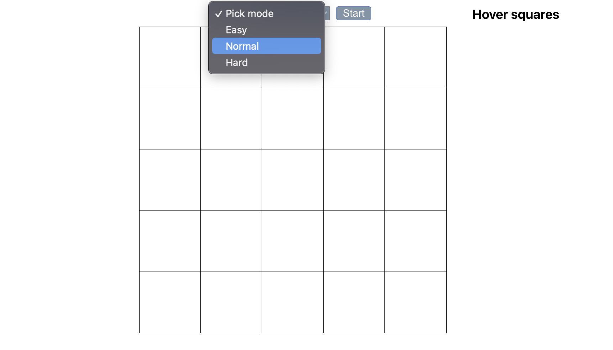
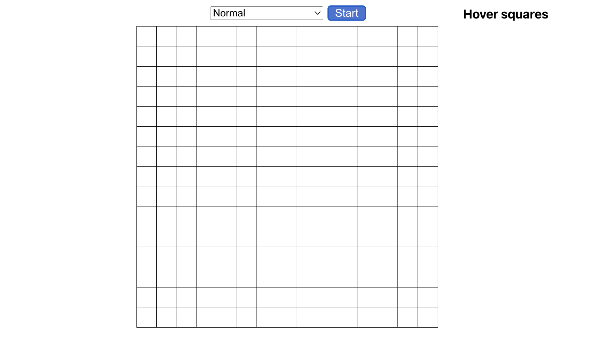
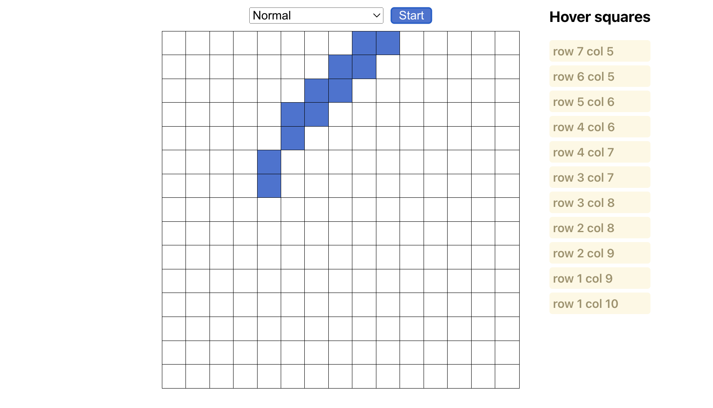

# Blue square

[demo](https://artemteslenko.github.io/blue-square-app/)

## Table of Contents

- [General Info](#general-information)
- [Technologies Used](#technologies-used)
- [Screenshots](#screenshots)
- [Contact](#contact)

## General Information

- It's a fun app which can help you if you're bored. (let's say standing in a line)

## Technologies Used

- HTML
- CSS
- JavaScript
- React

## Screenshots

-Pick mode

-Press start

-Enjoy

## Contact

Created by [Artem Teslenko](https://t.me/artemTeslenkoW126) - feel free to contact me!
